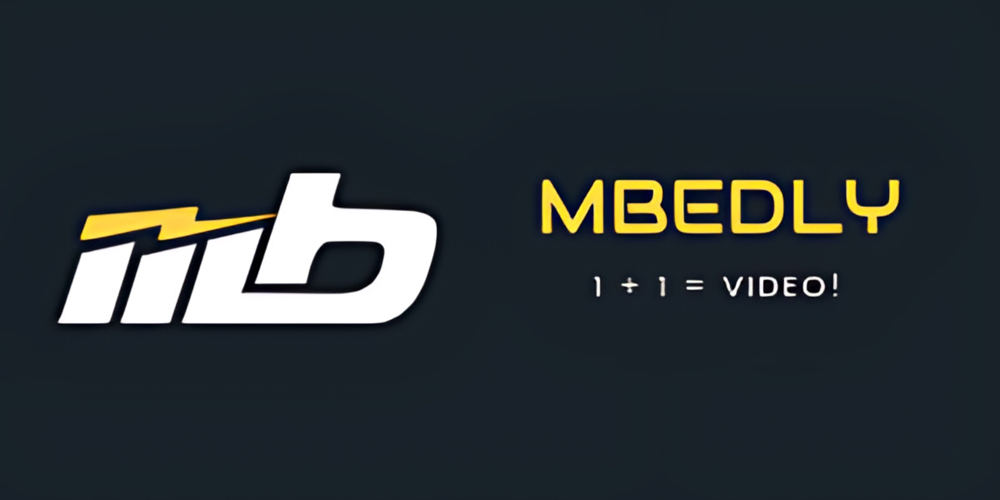
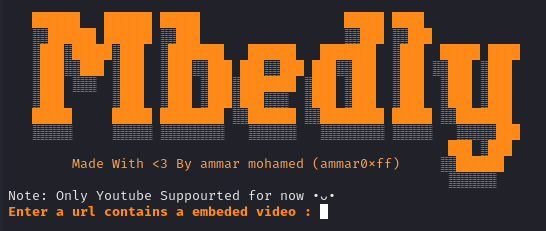

# Mbedly

<a id="readme-top"></a>

<!-- PROJECT SHIELDS -->

<p>
  
  
  
  
  
  
</p>


<!-- PROJECT LOGO -->

<br />
<div align="center">
  <a href="https://github.com/ammar0xff/Mbedly"></a>
  <h3 align="center">Mbedly</h3>
  <p align="center">
    A Full-Featured Video Downloader Supports Many Sites And Makes A Video From Literally Everything!!
    <br />
    <a href="https://github.com/ammar0xff/Mbedly/issues/new?labels=bug&template=bug-report---.md">Report Bug</a>
    ·
    <a href="https://github.com/ammar0xff/Mbedly/issues/new?labels=enhancement&template=feature-request---.md">Request
      Feature</a>
  </p>
</div>


<!-- TABLE OF CONTENTS -->

<details>
  <summary>Table of Contents</summary>
  <ol>
    <li>
      <a href="#about-the-project">About The Project</a>
      <ul>
        <li><a href="#built-with">Built With</a></li>
      </ul>
    </li>
    <li>
      <a href="#installation">Installation</a></li>
    <!-- <li><a href="#usage">Usage</a></li> -->
    <li><a href="#roadmap">Roadmap</a></li>
    <li><a href="#contributing">Contributing</a></li>
    <li><a href="#license">License</a></li>
    <li><a href="#contact">Contact</a></li>
    <li><a href="#acknowledgments">Acknowledgments</a></li>
  </ol>
</details>


<!-- ABOUT THE PROJECT -->
## About The Project
<a href="https://github.com/ammar0xff/Mbedly"></a>

Ever dreamed of a magical video downloader that could snatch up every single Udemy lecture like a squirrel hoarding acorns? Well, Mbedly is your fairy godmother! It's like a video-grabbing ninja, sneaking into all sorts of online classrooms and bringing back the loot (aka your favorite courses).

So, whether you're after a single video or an entire course series, Mbedly's got your back (as long as the site's on our magical <a href="#roadmap">Roadmap</a>, of course).


### Built With

<p>
	
  	


</p>


<!-- GETTING STARTED -->

## Installation

1. Clone the repo
```sh
git clone https://github.com/ammar0xff/Mbedly.git ; cd Mbedly
```
2. Install all necessary packages and libraries
```sh
sudo ./install.sh 
```


<!-- USAGE EXAMPLES -->
<!-- ## Usage

Use this space to show useful examples of how a project can be used. Additional screenshots, code examples and demos
work well in this space. You may also link to more resources.

_For more examples, please refer to the [Documentation](https://example.com)_ -->


<!-- ROADMAP -->
## Roadmap

- [x] Extract any embedded video links from any site & download it.
- [x] Download a youtube video like any regular downloader.
- [x] Auto-Extract supported sites:
  - [x] Mahara-Tech
  - [ ] EgyBest
  - [ ] Alison
  - [ ] Coursera
  - [ ] StarDima
  - [ ] Udemy
- [x] Supported Videos:
  - [x] YouTube
  - [ ] Facebook
  - [ ] Instagram
  - [ ] Twitter
  - [ ] TikTok
  - [ ] ViiiVideo
  - [ ] Mega

See the [open issues](https://github.com/ammar0xff/Mbedly/issues) for a full list of proposed features (and known
issues).


<!-- CONTRIBUTING -->
## Contributing

Contributions are what make the open source community such an amazing place to learn, inspire, and create. Any
contributions you make are **greatly appreciated**.

If you have a suggestion that would make this better, please fork the repo and create a pull request. You can also
simply open an issue with the tag "enhancement".
Don't forget to give the project a star! Thanks again!

1. Fork the Project
2. Create your Feature Branch (`git checkout -b feature/AmazingFeature`)
3. Commit your Changes (`git commit -m 'Add some AmazingFeature'`)
4. Push to the Branch (`git push origin feature/AmazingFeature`)
5. Open a Pull Request


### Top contributors:

<a href="https://github.com/ammar0xff/Mbedly/graphs/contributors">
  
</a>


<!-- LICENSE -->
## License

Distributed under the MIT License. See `LICENSE.txt` for more information.


<!-- CONTACT -->
## Contact

Ammar Mohamed - ammar0xf@gmail.com

Project Link: [https://github.com/ammar0xff/Mbedly](https://github.com/ammar0xff/Mbedly)


<!-- ACKNOWLEDGMENTS -->
## Acknowledgments

* [yt-dlp](https://github.com/yt-dlp/yt-dlp)
* [m3u8-download](https://github.com/williamchanrico/m3u8-download)

